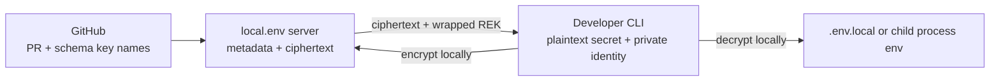
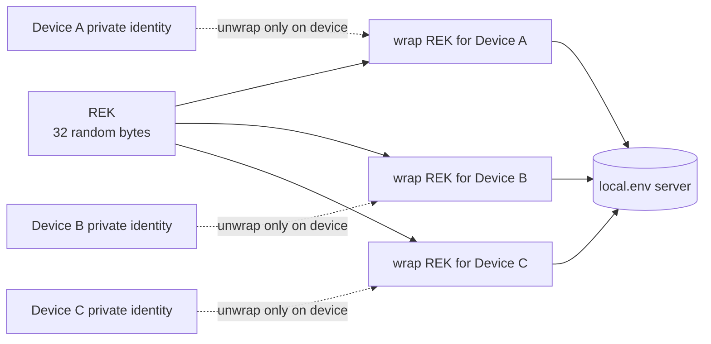
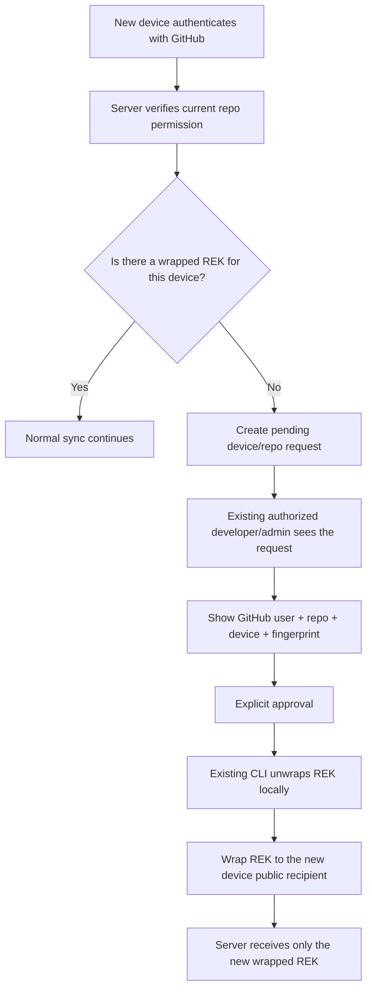
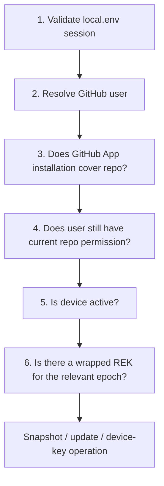
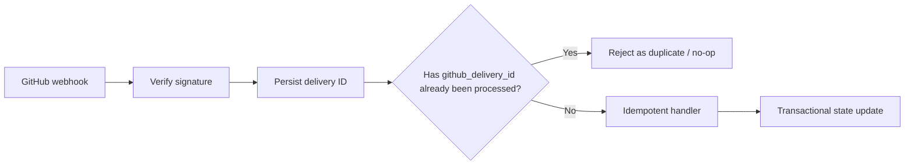
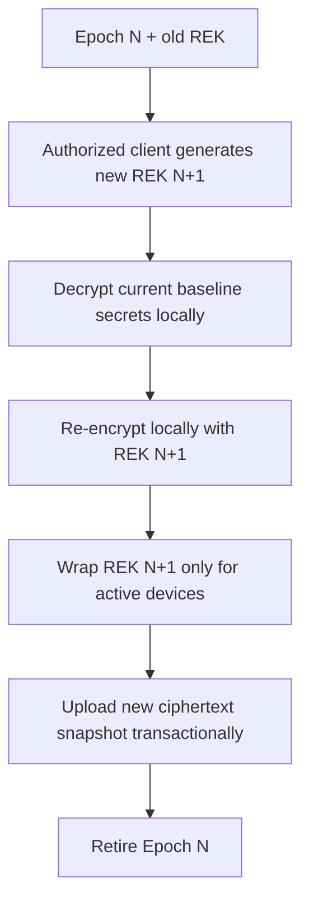
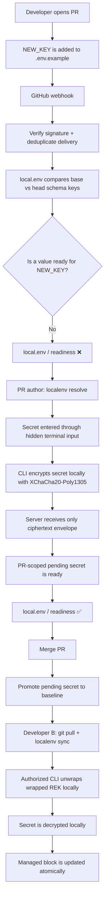

`local.env` is designed to keep a team's **local development** environment variables synchronized with the codebase. Its security model is shaped around that narrow problem.

This post explains the security contract in the `local.env` v1 implementation plan. The goal is not to claim that it is "an audited password manager" or "as secure as 1Password." The target is narrower and testable:

> Managed secret values are encrypted before they leave the developer's device, and the `local.env` server does not store the plaintext Repository Encryption Key required to decrypt them.

That distinction matters because the rest of the system is designed around this boundary: GitHub triggers the requirement, the server coordinates ciphertext and metadata, and actual decryption happens on an authorized developer device.

## Narrowing the problem is part of the security model

`local.env` is not a production secret manager.

Its scope is:

- Keep local-development environment variables synchronized across a team.
- Detect new requirements in schema files such as `.env.example` during the pull-request stage.
- Encrypt secret values on the device and send only ciphertext to the server.
- Decrypt those values locally again on authorized devices.

What is intentionally out of scope is broader:

- Production or staging secret management.
- Kubernetes secret management.
- CI/CD secret management.
- Replacing AWS Secrets Manager or HashiCorp Vault.
- Replacing 1Password.
- Automatic third-party credential rotation.
- Runtime service-to-service credentials.

That boundary matters for security. A goal like "manage every kind of secret in every environment" quickly pulls in entirely different security problems such as KMS, workload identity, broad RBAC, CI credentials, and automatic credential rotation.

`local.env` instead establishes a smaller contract:

1. **The secret is encrypted on the device.** The plaintext value becomes ciphertext through AEAD before it leaves the CLI.
2. **The server is a blind store.** The server knows the key name and metadata, but not the secret value or the plaintext REK.
3. **Decryption happens on the device.** An authorized device unwraps the REK with its private identity and decrypts the secret locally.



GitHub sees the code change. `local.env` sees that a required key exists. Only an authorized developer device sees the secret itself.

## What can the server see, and what can it not see?

The easiest way to understand the architecture is to separate its trust boundaries.

GitHub knows repository and pull-request metadata. The `local.env` server is the authentication, authorization, ciphertext, and metadata layer. The CLI is the cryptographic endpoint.

| Data | GitHub | local.env server | Authorized device |
|---|---|---|---|
| Key name, e.g. `STRIPE_SECRET_KEY` | May see it | May see it | May see it |
| Secret plaintext | Does not receive it | Does not receive it | Decrypts it |
| Ciphertext + nonce | Not required | Stores it | Downloads it |
| Plaintext REK | Does not receive it | Does not store it | Uses it in memory |
| Wrapped REK | Does not receive it | Stores one per device | Unwraps its own copy with its identity |
| Device private identity | Does not receive it | Does not receive it | Remains in secure credential storage |

The main security boundary is this:

> Plaintext secrets and plaintext REKs do not cross into the server side during the normal flow.

The goal is therefore that a stolen SQLite database alone should not reveal plaintext secrets. The expected dump contains ciphertext, nonces, metadata, and repository keys wrapped for individual devices. If an attacker does not have the corresponding device private identity, they cannot unwrap the REK; without the REK, they cannot turn the secret ciphertext into plaintext.

This does not mean "nothing happens if the server is compromised." The server is still a critical part of authentication, authorization, GitHub integration, and device provisioning. The security claim is narrower than that.

## Secret encryption: XChaCha20-Poly1305 + AAD

Every managed repository has a random **32-byte Repository Encryption Key**, or REK, for its active key epoch.

```text
REK = 32 random bytes
```

The REK is generated on an authorized client. Secret values are encrypted on the device with that key.

`XChaCha20-Poly1305` is used for secret encryption:

```text
ciphertext = XChaCha20-Poly1305(
  key       = REK,
  nonce     = random_24_bytes,
  plaintext = secret_value,
  aad       = canonical_metadata
)
```

A new random 24-byte nonce is used for every encryption operation. Random key material, nonces, session tokens, and similar values must be generated with cryptographically secure randomness.

### Why AEAD?

XChaCha20-Poly1305 provides more than confidentiality. It also authenticates ciphertext integrity.

If even one byte of the ciphertext changes, authentication fails. The CLI does not produce a decrypted value and does not modify the target file.

But ciphertext integrity by itself is not enough. If an attacker can move a valid ciphertext record to another repository, another key name, or another version in the database, the system should detect that too.

That is why encryption also includes **Associated Authenticated Data**, or AAD.

AAD binds ciphertext to a specific record. For example:

```json
{
  "instance_id": "uuid",
  "github_repo_id": 123456,
  "file_path": "apps/api/.env.local",
  "key_name": "STRIPE_SECRET_KEY",
  "scope": "baseline",
  "scope_id": "",
  "version": 15,
  "key_epoch": 3
}
```

A PR-scoped secret may use a different scope:

```json
{
  "scope": "pull_request",
  "scope_id": "100"
}
```

This metadata must be serialized in a deterministic, canonical form. Conceptually, for example:

```text
localenv:v1\0<instance-id>\0<repo-id>\0<file>\0<key>\0<scope>\0<scope-id>\0<version>\0<epoch>
```

As a result:

- If the ciphertext is modified, AEAD authentication fails.
- If ciphertext is moved to another key, authentication fails because the AAD changes.
- If ciphertext is moved to another repository or version, the same control applies.

Choosing a cryptographic primitive is not security by itself. Nonce generation, canonical AAD encoding, key lifecycle, secure device-identity storage, and error handling are all part of the same contract.

## Why is the REK not stored in plaintext on the server?

A symmetric REK keeps secret encryption fast and simple. But that REK still has to be distributed to authorized devices.

This is where the `age`/X25519 recipient model comes in.

Every device has two important pieces:

```text
private identity -> device secure credential storage
public recipient -> local.env server metadata
```

The server never receives the private identity. Instead, the same REK is wrapped separately to the public recipient of every authorized device.



The logical state on the server looks like this:

```text
wrap(REK, recipient A)
wrap(REK, recipient B)
wrap(REK, recipient C)
```

But it does not contain:

```text
plaintext REK
```

## Why does a new device not unlock automatically after GitHub login?

GitHub authentication and possession of cryptographic key material are not the same thing.

A user may have GitHub access to a repository. That does not mean a new device should automatically receive the repository encryption key.

That is why new-device onboarding has two stages:



During approval, the user should see at least:

- GitHub user.
- Repository.
- New device name.
- Public-key fingerprint.
- Request code.

The fingerprint is an important mitigation here. A server that has become actively malicious could attempt public-key substitution during provisioning. A visible fingerprint and explicit approval reduce that risk; they are not claimed to eliminate it completely.

## "The token is valid" does not automatically mean repository access

`local.env` uses GitHub as the human identity provider. It does not maintain a separate password database.

After GitHub login, the CLI receives a cryptographically random opaque session token. The token should have at least 256 bits of randomness, and the server should store only its cryptographic hash.

The client token should be stored in OS secure credential storage whenever possible:

- macOS: Keychain.
- Windows: Credential Manager.
- Linux desktop: Secret Service.

The token is not passed as a shell argument.

For every repository API call, an authorization chain runs instead of checking only the session token:



This is especially important before:

- Returning a ciphertext snapshot.
- Accepting a secret update.
- Accepting a device-key request.

Permission checks may be cached briefly because of GitHub rate limits. But the cache must not behave like permanent authorization state. When a user's access is removed, that change must not remain hidden behind the cache indefinitely.

Logout and device revocation are also more than simply deleting a token on the client; the corresponding session must be invalidated server-side.

## The GitHub App asks for as little permission as possible

`local.env` is not on GitHub to write source code. It is there to read schema changes, produce a PR readiness check, and update a sticky comment when needed.

That is why the GitHub App permission surface is kept narrow:

| Permission | Level | Why? |
|---|---|---|
| Contents | Read | Read `.env.example` and `localenv.yaml` |
| Pull requests | Read | PR base/head and metadata |
| Checks | Write | Produce the `local.env / readiness` check |
| Issues | Write | PR comments, when enabled |
| Metadata | Read | Repository identity |

Permissions that are explicitly not requested:

```text
Contents: Write
Actions: Write
Administration: Write
Secrets: Write
```

`Issues: Write` is only needed for PR comments. If the comment feature is removed, that permission can be removed too.

### The webhook surface

A GitHub webhook is not processed merely because the system assumes it "came from GitHub."



Every webhook signature is verified with the GitHub webhook secret before the body is processed.

Delivery IDs are unique:

```text
UNIQUE(github_delivery_id)
```

Handlers must be idempotent. If the same delivery arrives again, repository or PR state must not be corrupted a second time.

Minimal permissions alone are not enough. Signature verification, delivery deduplication, and idempotent transaction handling work together to keep the webhook surface controlled.

## Decryption is not enough: `.env.local` writes must also be safe

`localenv sync` does not take ownership of the developer's entire `.env.local` file.

It manages only values inside an explicit marker block:

```dotenv
# developer-owned variables may exist above
MY_DEBUG_FLAG=true

# >>> local.env managed - do not edit manually
DATABASE_URL="..."
REDIS_URL="..."
STRIPE_SECRET_KEY="..."
# <<< local.env managed

# developer-owned variables may exist below
```

The rules are:

- `local.env` changes only the content between the markers.
- Values outside the markers are considered developer-owned.
- If a managed key is also defined outside the marker block, the operation stops instead of silently overriding it.
- Unrelated content is preserved.
- Writes happen through a temporary file in the same directory.
- The temporary file is flushed and closed.
- The target is replaced with an atomic rename.
- On Unix, the target mode is `0600`.
- The user is warned if the target is not covered by `.gitignore`.
- `local.env` never commits the target file automatically.

If decryption fails, the target file must not be partially updated. Sync should behave all-or-nothing per target file.

## Stricter mode: never create a plaintext secret file

For framework compatibility, `localenv sync` may write plaintext into `.env.local`. But teams that do not want managed secrets left on disk can use a stricter mode:

```bash
localenv run -- npm run dev
```

The flow is:


Plaintext still exists in process memory and the child process environment, so this mode is not magical protection against a compromised developer machine. But it prevents a managed plaintext secret file from remaining on disk.

## Revoking a device cannot erase the past

If a device has already decrypted a secret, `local.env` cannot later retrieve it from that device's disk or from the user's knowledge.

The real objective of revocation is therefore to **cut off future access**.

When a device is revoked:

1. The corresponding local.env session is revoked.
2. The server stops returning snapshots to that device.
3. Wrapped REK records for that device are deleted.
4. Repository-key rotation is triggered or strongly recommended.

But that alone is not enough. A revoked device may have previously retained the old REK in memory or somewhere else. A new key epoch is required so that the old key cannot decrypt future ciphertext.

### Cryptographic future revocation



Conceptual commands:

```bash
localenv devices revoke <device-id>
localenv keys rotate
```

This does not take back secrets the old device already learned. It only aims to prevent the old REK from decrypting future repository state.

If an employee has previously seen, for example, an AWS, Stripe, or database credential, the real credential may still need to be rotated at the provider. `local.env` v1 does not automate that.

## Threat model: what attacks is it designed to resist?

A good security model is valuable not only because of what it claims to protect, but also because it clearly states what it does not protect.

| Scenario | Expected result | Control |
|---|---|---|
| SQLite database or backup is stolen | Plaintext secrets should not be directly recoverable | Ciphertext + device-wrapped REK; private identity is not on the server |
| Ciphertext is modified | Decryption should fail | AEAD authentication |
| Ciphertext is moved to another record | Decryption should fail | AAD binding |
| Unauthorized GitHub user calls the API | Snapshot/update should be rejected | Current repo permission + installation + active device check |
| Webhook is replayed | State should not be corrupted a second time | Delivery ID uniqueness + idempotency |
| Server logs are inspected | Secret/REK/token should not appear | Forbidden log fields + sentinel leakage tests |

### Out of scope or not fully protected

**Compromised developer machine.** If malware can read process memory or `.env.local`, the secret can be exposed.

**Secret synced before an employee leaves.** Previously acquired knowledge cannot be cryptographically "un-seen." The real credential should be rotated when necessary.

**Malicious modified CLI.** Signed releases and distribution integrity reduce this risk; they do not eliminate a compromised endpoint.

**Actively malicious server during provisioning.** The server may attempt public-key substitution. Visible fingerprint + explicit approval is the mitigation for this risk.

For that reason, an absolute statement such as "nothing happens if the server is compromised" would be incorrect.

A more accurate statement is: the server does not store plaintext secrets or plaintext REKs in the normal design. But it is still a critical component for authentication, authorization, metadata, GitHub integration, and device provisioning.

## Operational controls beyond cryptography

Even correct secret encryption can be undermined through TLS, logging, release, or distribution failures. Operational controls are therefore part of the security model too.

### TLS

TLS must terminate at the reverse proxy/ingress or directly at the server. Normal deployment over plain HTTP is not part of the supported security model.

### Structured logging

Logs may contain metadata such as repository names, key names, or audit actions. But they must not contain:

```text
secret plaintext
plaintext REK
session bearer token
GitHub App private key
unwrapped key contents
```

Log-leakage tests should use recognizable sentinel secret values and verify that those values never appear in captured logs.

### Backup and restore

SQLite, GitHub App configuration, and instance state must be recoverable. Encrypted blobs remain ciphertext inside backups.

The security expectation for a stolen backup is the same as for a stolen SQLite database: managed secret plaintext should not be directly available without the corresponding device private identity.

### Release integrity

Planned controls for release artifacts include:

- Checksums.
- Signed Git tags/releases.
- SBOM.
- Container image digest.
- Vulnerability scanning.
- Container scanning.
- A `SECURITY.md` with a private vulnerability-reporting path.

## How is the security claim tested?

The value of the security model should be measured more by acceptance tests than by marketing language.

### Tamper test

Change one byte of ciphertext inside SQLite.

Expected result:

```text
authenticated decryption error
no target file modified
```

### Leak test

Test with a known sentinel secret value. Then search the logs and serialized envelopes.

Expected result:

```text
plaintext secret not found
```

### Revocation test

Revoke a device and rotate the REK. Create a new secret version after rotation.

Expected result:

```text
revoked device cannot receive a snapshot through the API
old retained REK cannot decrypt new-epoch ciphertext
active device can sync normally
```

### Restore test

Restore a backup into a fresh volume/container.

Expected result:

```text
active developer can sync and decrypt existing state
GitHub webhook processing continues
```

### Permission test

When GitHub repository access is removed, local.env API access should stop after the short authorization-cache window expires.

### Safe-write test

If any secret cannot be decrypted, the corresponding target env file must not be modified.

The purpose of these tests is not to say "we are very secure," but to prove narrower technical claims:

- No plaintext REK on the server.
- No plaintext managed secret on the server.
- No plaintext secret in logs.
- Tampered ciphertext is rejected.
- A revoked device cannot decrypt the new epoch.
- A failed decrypt does not corrupt the target env file.

## What does the normal development flow look like?

The purpose of the entire security model is to keep secrets synchronized across a team without breaking the developer's natural PR workflow, sending secrets to GitHub, or turning server storage into plaintext secret storage.



If the stricter runtime mode is used, the final step is different:

```text
localenv run -- <command>
```

The CLI decrypts the secret in memory and injects it into the child process environment; it does not create a managed `.env.local` file.

## The security model can be reduced to one principle

Instead of making the `local.env` server the owner of secrets, the design tries to make it an access-controlled **ciphertext + metadata coordination layer**.

This model is not based on an absolute zero-trust slogan such as "we do not trust the server at all." The server is still a critical component in:

- Authentication flows.
- GitHub permission checks.
- Device provisioning.
- Repository and PR metadata coordination.
- Ciphertext storage and synchronization.

But if the server is compromised, the design aims to prevent the attacker from finding a plaintext secret table or a plaintext repository encryption key sitting there directly.

That objective depends on several layers working correctly together:

**Cryptography:** XChaCha20-Poly1305, random nonces, canonical AAD, and age/X25519 device wrapping.

**Identity and authorization:** GitHub identity, hashed opaque sessions, current repository permission, GitHub App installation, and active-device checks.

**Endpoint lifecycle:** Explicit device approval, visible fingerprints, revocation, and REK epoch rotation.

**Operational hygiene:** TLS, no-secret logs, safe env writes, signed releases, SBOM, and acceptance tests.

Ultimately, the most accurate security claim for `local.env` is:

> Managed secret values are encrypted before they leave the developer's device. The `local.env` server does not store the plaintext repository encryption keys required to decrypt them.

That sentence only becomes a strong product claim once the implementation and release tests actually prove that the system behaves as designed.
